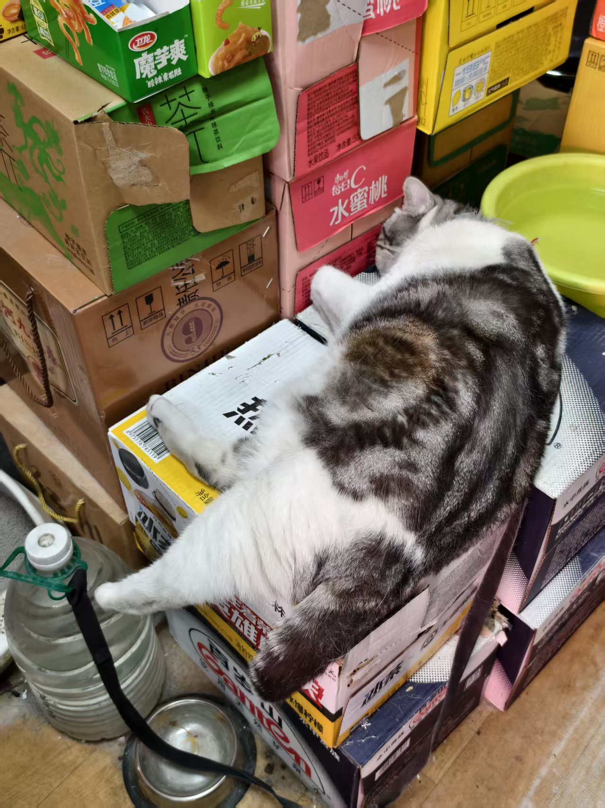

We went to Xinjiang again! Yes, again. Last year we went to the north. This year to the south.

But before then we spent a few days around Shennongjia, where I saw this little mouse munching on grass.

And then we went to the lakes, where there was this person playing fetch with his dog. He'd throw the tennis ball into the lake.

And then we went to Xi'an where we rode bikes around the city wall, an entire loop, and my butt hurt for days afterwards but it was worth it. It rained one morning and Dad slid and smashed his face on the ground, but he was fine.

And then we flew to Kashgar![^1] We went to the Ancient City the first day, where Dad loudly complained about some fancy little souvenirs being made with purple copper. "Purple copper," he said as no one listened, "is so cheap to buy *and* to process. This costs a tenth of the price it's sold for." Dawaköl desert next. The adults convinced me (by not giving me enough time to decide before buying the tickets) into riding one of those cars where they drive really fast across the dunes so it felt like a roller coaster. 0/0 do not recommend. Also rode horses and camels! I never talked to the employee but my parents of course had to strike up a conversation and they said the camels were worth like 30k yuan each and he owned like 15 of them, pulling them out here every week or so to work. That was apparently the only conversation topic my parents were interested in.

And then we went to Tashqurghan. On the way we stopped at the white sand lake. When we got there, we were pretty much fine, none of us experienced altitude sickness too terribly. We drove up the mountain where it was cold as fuck, had yak hotpot which honestly still wasn't as good as Chaoshan's (nothing can beat that!!!), went up to Qonjirap at 5km altitude and was pretty much fine (it snowed the day before we went, and there was still snow on the ground, *and* it also snowed really bad the day after), had some great Tajik food. Many groundhogs along the way, but unfortunately I didn't see any fighting this time round. Their butts alone are satisfying enough though, the huge butts bouncing up and down as they ran. People told us they're pretty bad for the environment now though, fewer predators, eating all the grass.

Saw the cutest puppy ever.

The inn owner told us about a horse race the next day, and we did see some people in uniform riding horses when we drove back. The next day it rained so it got canceled LOL. Went to the glacier, was *not* super fine, too cold! On the way back, saw a horsie lying down.

Horsie gotta feel super secure and safe to be lying down like that! They usually sleep standing up so they can run away from danger quicker, but they still need to lie down to get deep sleep.

After that we got back to Kashgar and went to the Ancient City again, earlier this time to catch the opening ceremony where I stared at the backs of a bunch of people's heads. And we bought some goods to send back home. After that we decided to visit the local markets. Sure the Ancient City has a lot of tourist souvenirs and stuff but only in the local markets can you see absolutely adorable kitties.

They're selling this baby for 10 yuan because their mama cat went outside to play and came back pregnant again. I would've bought it if I lived around the area. So adorable. I actually got to utter a Uyghur word once because Mom asked for garlic and the stall owner didn't understand, so I said "سامساق؟" and promptly didn't understand her response, but it wasn't hard to get that they didn't have garlic there. Also Labubu car.

Anyway, big butt sheep with their big butts.

We also went to the Small Knife Museum where it seems you can skirt the definition of "small."

For context, this knife was made to be a giant small knife. It's the same overall shape and process as all the other Yëngisar small knives. Took like 10 people.

Yëngisar was also famous for its pottery. At first I thought the 7th generation pottery master Abdurehim Memetmin had artfully named his son, the 8th generation, Memetmin Abdurehim, but then I realized either I or the poster got the formatting a bit wrong. Would be funny if someone actually named their kid like that though.

We also went to a Darwaz performance, which is basically just tightrope walking. He would walk from this tower across the lake to the other tower, holding a pole in his hands for balance. Dad asked me whether I think he was going to walk back, and without waiting for an answer pointed out that his electric scooter was parked at this tower so he would have to walk back again. Locals told us that the guy was basically just public practicing and was preparing for a competition. Said locals were seemingly more interested in an old man dancing. I wish I could put a video here but I don't wanna go through the hassle, but basically the man was just spinning around.

In the end, we flew back, but had a 1-day layover in Lanzhou so we went by the Yellow River and promptly decided against rafting in it. We also went to the museum and saw the horsie.

Also rock croissants.

And there's this EXTEREMELY FAT cat in a grocery store!!!

And after that, home we went. It was a great but tiring trip! I have learned my lesson that I simply can't be away from home and running around for long, and the endless kawap after polo after kawap for meals was not something I could get used to. Also I finished Umineko in the middle of it. T'was peak.

[^1]: Still decided to go with the conventional spelling LOL.
